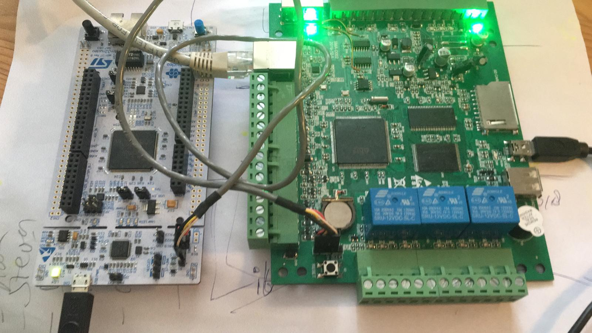

# Match dev notes


### Run Match tests
```screen /dev/cu.usbmodem411 9600 ```	( mac)

```screen /dev/ttyACM1 9600``` 	(linux)

Copy paste into console: Help

Exit screen ctrl+a - K - y 

### Flash Match test firmware

```st-flash  --reset write match1.bin 0x8000000```

------
### ST-link 
https://github.com/stlink-org/stlink

st-info getting from the Nucleo bord 
```
$ stm32-toolchain st-info --probe
Found 1 stlink programmers
 serial: 303637364646353335313535383738
openocd: "\x30\x36\x37\x36\x46\x46\x35\x33\x35\x31\x35\x35\x38\x37\x38"
  flash: 2.097.152 (pagesize: 16.384)
   sram: 262144
 chipid: 0x0419
  descr: F42x and F43x device
```
st-info from the Match board connected through st-link from Nucleo
```
$ stm32-toolchain st-info --probe
Found 1 stlink programmers
 serial: 303637364646353335313535383738
openocd: "\x30\x36\x37\x36\x46\x46\x35\x33\x35\x31\x35\x35\x38\x37\x38"
  flash: 1.048.576 (pagesize: 16.384)
   sram: 262144
 chipid: 0x0419
  descr: F42x and F43x device
```
I tried an example from https://os.mbed.com/ that worked on the Nucleo, but it didn't gave any output on Match
```
$ st-flash write mbed-os-tcp-server-example.NUCLEO_F439ZI.bin 0x8000000
st-flash 1.5.0
2020-02-22T22:57:44 INFO common.c: Loading device parameters....
2020-02-22T22:57:44 INFO common.c: Device connected is: F42x and F43x device, id 0x20036419
2020-02-22T22:57:44 INFO common.c: SRAM size: 0x40000 bytes (256 KiB), Flash: 0x200000 bytes (2048 KiB) in pages of 16384 bytes
2020-02-22T22:57:44 INFO common.c: Attempting to write 92860 (0x16abc) bytes to stm32 address: 134217728 (0x8000000)
Flash page at addr: 0x08010000 erasedEraseFlash - Sector:0x4 Size:0x10000 
2020-02-22T22:57:47 INFO common.c: Finished erasing 5 pages of 65536 (0x10000) bytes
2020-02-22T22:57:47 INFO common.c: Starting Flash write for F2/F4/L4
2020-02-22T22:57:47 INFO flash_loader.c: Successfully loaded flash loader in sram
enabling 32-bit flash writes
size: 32768
size: 32768
size: 27324
2020-02-22T22:57:48 INFO common.c: Starting verification of write complete
2020-02-22T22:57:49 INFO common.c: Flash written and verified! jolly good!
```
------
### OpenOCD
OpenOCD from the Match board connected through st-link from Nucleo 
http://openocd.org/getting-openocd/

```
$ openocd -f st_nucleo_f4.cfg
Open On-Chip Debugger 0.10.0
Licensed under GNU GPL v2
For bug reports, read
	http://openocd.org/doc/doxygen/bugs.html
Info : The selected transport took over low-level target control. The results might differ compared to plain JTAG/SWD
adapter speed: 2000 kHz
adapter_nsrst_delay: 100
none separate
srst_only separate srst_nogate srst_open_drain connect_deassert_srst
Info : Unable to match requested speed 2000 kHz, using 1800 kHz
Info : Unable to match requested speed 2000 kHz, using 1800 kHz
Info : clock speed 1800 kHz
Info : STLINK v2 JTAG v29 API v2 SWIM v18 VID 0x0483 PID 0x374B
Info : using stlink api v2
Info : Target voltage: 0.077216
Error: target voltage may be too low for reliable debugging
Info : stm32f4x.cpu: hardware has 6 breakpoints, 4 watchpoints
Info : accepting 'telnet' connection on tcp/4444
Info : device id = 0x20036419
Info : flash size = 1024kbytes
Info : Single Bank 1024 kiB STM32F42x/43x/469/479 found
flash 'stm32f2x' found at 0x08000000
```
Connect through telnet to OpenOCD
```
telnet localhost 4444
reset init
flash probe 0
halt
```
Flash bin
```
init
reset init
flash probe 0
flash info 0
flash write_image erase mbed-os-tcp-server-example.NUCLEO_F439ZI.bin 0x8000000
reset run
shutdown
```
------
### Buildroot
https://buildroot.org

In the buildroot directory are the resulting binaries from a linux build that I hoped would work.<br/>
They can be flashed to Match by using the flash script.sh, which uses OpenOCD
```
 ./flash.sh 
```

At https://github.com/pjeutr/buildroot I cloned the buildroot repository which I used for the build. <br/>
By using stm32f429-disco which I expect to be almost the same as Match and adding the network connection. <br/>
This is how a build can be made. I tried several options in menuconfig, but haven't found a working solution yet. <br/>
```
cp ./configs/stm32f429_disco_defconfig .config
make menuconfig (optional, but here you can configure hardware options)
make (this wil take several minutes)
```
Flash buildroot to Match
```
board/stmicroelectronics/stm32f429-disco/flash.sh output/ stm32f429disc1
```
------
### Zephyr
Obsolete now

Zephyr is used to test gdb on the Nucleo, easy to make a quick test build.

https://docs.zephyrproject.org/latest/boards/arm/nucleo_f429zi/doc/index.html


